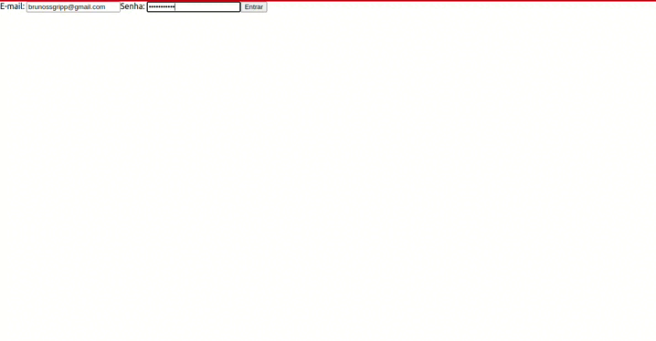
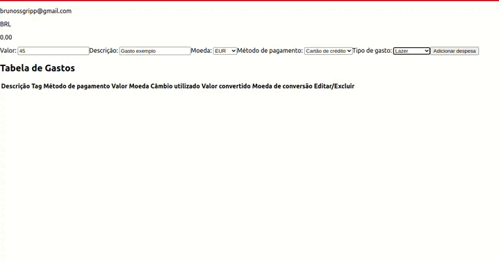

# Projeto 13 - TrybeWallet

Oi. Este foi um dos projetos que eu fiz durante meu curso na Trybe. Confira os detalhes dele abaixo.

## Nome do Projeto
Trybe Wallet (Carteira da Trybe)

## Linguagens e Ferramentas Utilizadas

 - JavaScript
 - [Biblioteca React](https://pt-br.reactjs.org/)
 - [React Router](https://reactrouter.com/en/main)
 - [Redux](https://redux.js.org/)
 - [React Redux](https://react-redux.js.org/)

## Objetivos do Projeto
A aplicação desenvolvida neste projeto foi uma carteira de controle de gastos, com conversor de moedas. A pessoa usuária é capaz de: adicionar, remover e editar um gasto; visualizar uma tabelas com seus gastos; e visualizar o total de gastos convertidos para uma moeda de escolha. 
O intuito desse projeto foi colocar em prática as habilidades desenvolvidas com o Redux (no caso, o Redux em conjunto com o React) dentre elas: criar um store; criar reducers; criar actions; criar dispatchers; conectar Redux aos componentes React; e criar actions assíncronas na sua aplicação React que faz uso de Redux.

 
Abaixo estão capturas de tela do projeto (vale lembrar que o objetivo principal do projeto era desenvolver a aplicação com foco na arquitetura do site utilizando React e Redux, e, por isso, não foi desenvolvido o CSS, portanto a aplicação está sem estilização".
 

 
Página Inicial de login, e clicando "enter", que redireciona para a carteira:

 
Na página inicial, ao clicar em uma categoria, os produtos disponíveis são dispostos abaixo (no caso, alimentos e bebidas):

 
Na página inicial, ao buscar algum termo, os produtos encontrados são dispostos abaixo (no caso, a busca foi "brinquedo"):

 
Ao clicar em um item, é direcionado para a página de detalhes respectiva do produto.
Na página do produto é possível adicioná-lo ao carrinho, fazer avaliações, e também há um link para a página de carrinho:

 
Na página de carrinho, é possível alterar as quantidades de cada produto, removê-los, ou clicar no link que redireciona para a finalização da compra:

 
Na página de checkout (finalização), é possível ver um resumo dos produtos que estão sendo comprados, e digitar um formulário para pagamento (inacabado), e, por fim, terminar a compra:

## Instruções para visualização
Comando para clonar o projeto:
 - `git clone git@github.com:BrunoSayago/projeto-11-FrontEndOnlineStore.git`
 
Se necessário, instalar as dependências:
 - `npm install`
  
O projeto pode ser visualizado no navegador utilizando o comando:
- `npm start`
